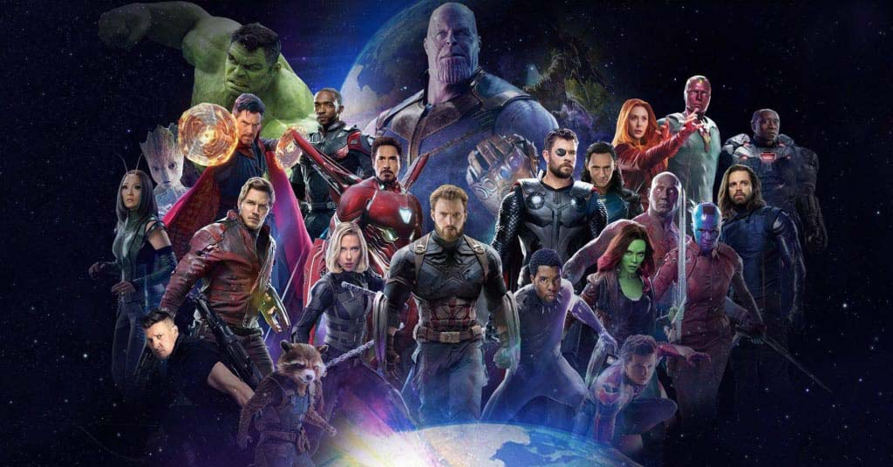

## Marvel Quiz - Python text-based interactive game!

Think of a Marvel character and I will try to guess who the character is 

### Prerequisites

All you need is [Python 3](https://www.python.org/) to play.

### Usage
Clone the project, <code>cd</code> to your directory/download, and run the game.py file in a Python 3 shell (Terminal on a mac / Linux, Windows command prompt).

### Rules
Simple rule - Just think of a Marvel character and answer the question.

**Choose your weapon wisely!**

Built with [Python 3](https://www.python.org/doc/)

Enjoy!

### Author
Joanna Chow

### License 
MIT
